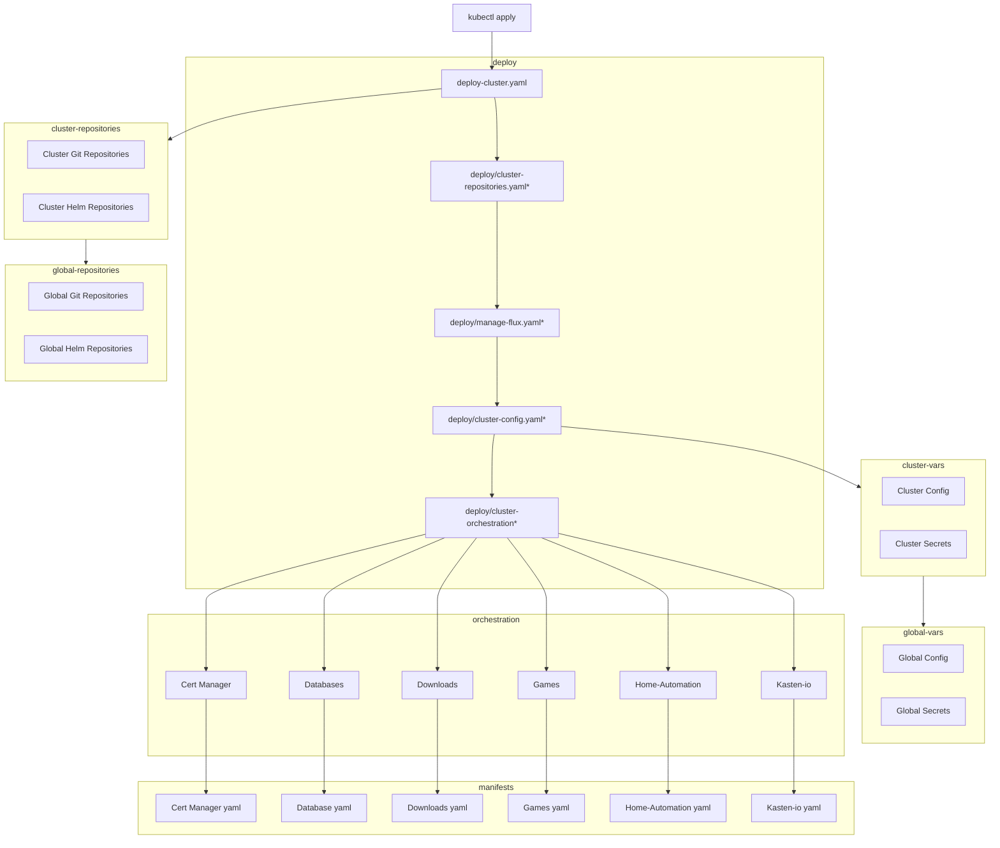

---
hide:
  - toc
---
## Bootstrap flow

The folder-structure doc still makes it a bit tricky to see the dependancies and workflow for the cluster.  Ill attempt to clarify that a bit with a confusing speghetti flowchart.

!!! Note "* Steps require reconciliation of prior step"
    In the deployment subgraph, each step uses ```dependsOn`` in the yaml to require the previous step fully reconciled before it proceeds.

    In this way, there is a layering where the cluster will load the repositories, flux managment layer, variables, and finally orchestration to start installing apps in order.


