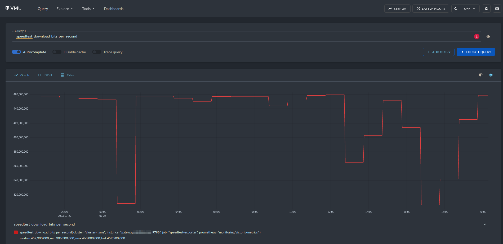
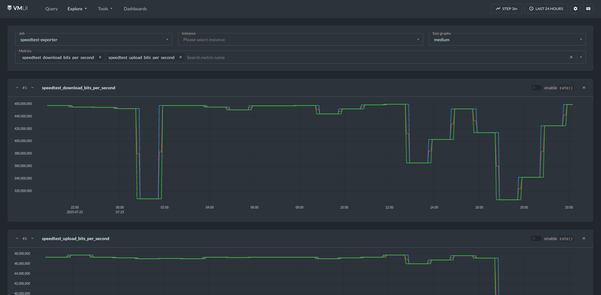
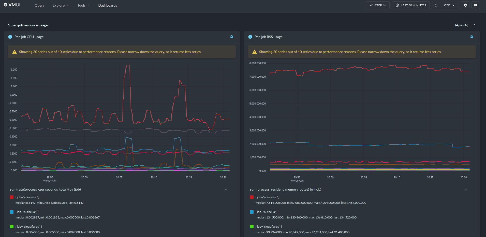
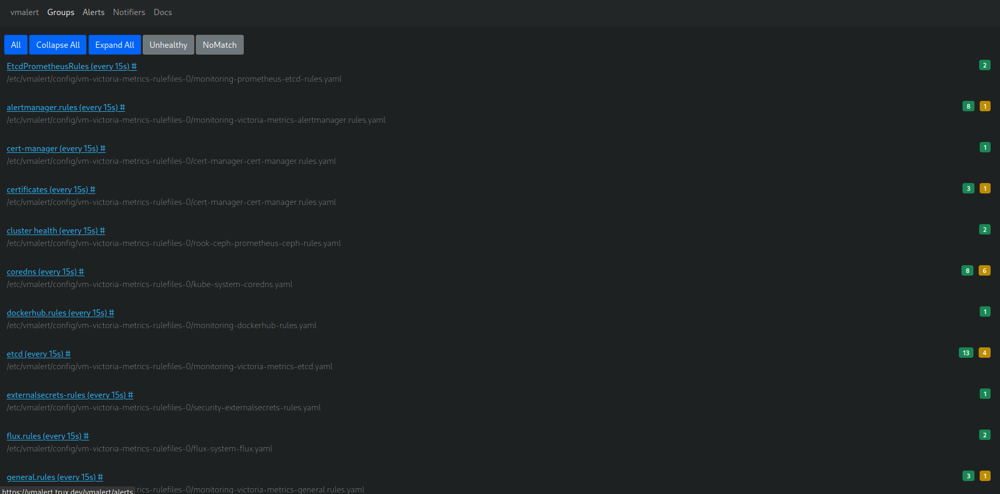

# VictoriaMetrics stack

# Deprecated

Sadly, I have deprecated this experiemnt on the deeper understanging of HA VMCluster (sepcifically VMAgent)

When running in HA mode, Prometheus will spread scrape targets between live replicas, resulting in a distributed, shared effort to scrape targets. This is my desired mode.

VM's method of providing HA is to ask _all_ of its VM agent replicas to scrape all targets for metrics. These are all passed to the cluster, which then dedupes them resulting in one metric entry.
If a portion of vmagents go down it just means that less duplicate scrapes occur.

Until running VM, I hadn't considered this approach breaks things in my homelab, namely my speedtest-exporter pod on my router. I endedup with multiple speedtests being run concurrently and sending wacky metrics back, that took some debugging.
Due to this, VM is sadly not for my lab.

# Intro

VictoriaMetrics is a (somewhat) drop-in replacement to the ubiquitous Prometheus/Thanos/Alertmanager stack.
It is more lightweight and space efficient with metrics, and is very snappy when running on NVMe only.

Some posts:
https://medium.com/israeli-tech-radar/all-at-once-monster-multi-site-monitoring-platform-with-victoriametrics-ebed75c3c5e

# ToDO

- Work out how to make Alertmanager link to correct externalURL for VMALert
- Work out how to setup kubescheduler scrapes with Talos

# Components

## VMOperator

A operator that comes with CRD's and manages rollouts of other VM components based on CRD manifests.
Specs for CRD's etc can be found https://docs.victoriametrics.com/operator/api.html

## VMAgent

_Stateless_ (Optional)
A 'tiny but brave agent' that scrapes sources for metrics and sends them to VMInsert for ingestion via remote_write.
Has a UI where you can view configured targets and their status
Landing page looks bare but has some links to the expected targets/discovery/relabel debug/

## VMSingle

_Stateless_
A fast time-scale database. For non-HA installs.

## VMCluster

_Stateless_
A fast time-scale database. For HA installs.

## VMStorage

_Stateful_
Stores the raw data and returns queried data based on given timerange/labels.

## VMSelect

_Stateful_
Runs queries on distributed storage devices.
Also contains a UI called VMUI that is like a souped-up version of the Prometheus UI.
VMUI can be found at https://vmselect.domain.tld/select/0/vmui/
(The landing page doesn't show you anything except a link to docs!)

## VMInsert

_Stateless_
Writes metrics from VMAgent and spreads writes to VMStorage pods.

## VMAlert

_Stateless_
Watches metrics and triggers alerts. Not as comprehensive as Prometheus Alertmanager so we send its alerts to Alertmanager for further action
Has a UI to view raw alerts triggered like Prometheus does.

## Alertmanager

_Stateful_ (Optional)
Our beloved Prometheus Alertmanager. Takes alerts from VMAlert and does the needful.
This is still where you work with/get notifications from/silence.

## node-exporter

_Stateless_

Exports metrics of a node, ex:

- System (CPU/RAM/Disk/Network)
- Filesystem
- Process
- Harware (temps)
- Time

You can enable this in the VM stack chart, but I have deployed seperately to reduce dependance on the VM maintainers to keep their helm templates for it up to 2023-07-26

## kube-state-metrics

_Stateless_

Exports kube API metrics of the kubernetes resources of a node, ex:

- Pod metrics
- Node metrics (NodeReady, Conditions, etc - different to node-exporters metrics)
- Namespace metrics
- Deployment/Replicaset/Statefulset/Daemonset
- CronJobs/Jobs

You can enable this in the VM stack chart, but I have deployed seperately to reduce dependance on the VM maintainers to keep their helm templates for it up to 2023-07-26

## Grafana

_Stateless_ (Optional)
Our beloved Grafana. Queries VMSelect as needed if selected as a data source.

# Differences to Prometheus/Thanos/Alertmanager

Well, for me, I never managed to get Thanos to dedupe properly and this worked out-of-the-box so... ¯\_(ツ)\_/¯
Short version is that it does appear in my cluster to be lighter and much faster than the traditional stack.
I have also removed using S3 from my setup, and it appears very space efficient.

# Setup

## Lite (vmsingle)

Not yet personally attempted

## High-Avaliable (vmcluster)

Key points:

- Set `replicaCount:` to 3
- Added `extraArgs - dedup.minScrapeInterval` to VMStorage, VMCluster and VMSelect.
- Changed VMAgent scrapeInterval to 60s instead of default 30seemed
- Added my own custom additinalscrapes in Prometheus format to a secret and added into VMAgent
- VMUi is sort of hidden - its in the vmselect pod but you have to browse to /select/0/vmui/ to load it, the base URL just shows a link to docs.

## Grafana

- Called the VictoriaMetrics data source 'Prometheus' as it was easier than trying to get all my graphs to change data source (some seem to be a bit too hardcoded)
- VM data source needs `/select/0/promethus` appended to the URL
- Added VictoriaMetrics dashboards to my setup manually – there isn't currently a `forceDeployDashboards` like prom-kube-stack

# Screenshots

## VMAgent

## VMUI

## VMAlert

